# Architecture

This document describes the internal design of rustdata: how the crates relate, how data flows through the system at compile time and at runtime, and why each component is built the way it is.

---

## Table of contents

1. [Crate structure](#1-crate-structure)
2. [Dependency graph](#2-dependency-graph)
3. [Compile-time pipeline](#3-compile-time-pipeline)
4. [`rustdata-core`](#4-rustdata-core)
   - [Backend abstraction](#41-backend-abstraction)
   - [`EntityDescriptor` trait](#42-entitydescriptor-trait)
   - [`CrudRepository` method surface](#43-crudrepository-method-surface)
   - [SQL generation and caching](#44-sql-generation-and-caching)
   - [`#[derive(Entity)]`](#45-deriveentity)
   - [`#[derive(QueryMethods)]`](#46-derivequerymethods)
   - [Soft delete](#47-soft-delete)
   - [Lifecycle hooks](#48-lifecycle-hooks)
   - [Pagination](#49-pagination)
   - [Specification pattern](#410-specification-pattern)
   - [Error handling](#411-error-handling)
   - [Transactions](#412-transactions)
5. [`rustdata-migrations`](#5-rustdata-migrations)
   - [Compile-time embedding](#51-compile-time-embedding)
   - [`migrate!` macro](#52-migrate-macro)
   - [Runner](#53-runner)
   - [Transpiler](#54-transpiler)
6. [Data flow: a single `insert`](#6-data-flow-a-single-insert)
7. [Data flow: migration startup](#7-data-flow-migration-startup)
8. [Design decisions](#8-design-decisions)

---

## 1. Crate structure

```
rustdata/
├── crates/
│   ├── rustdata-core/        # Main library — repository, derives, backends, dialect
│   ├── rustdata-macros/      # Proc-macro crate (separate Rust requirement)
│   └── rustdata-migrations/  # SQL transpiler + compile-time migration runner
```

`rustdata-macros` must be a separate crate because Rust requires proc-macro crates to compile for the **build host**, not the target. It is re-exported wholesale by `rustdata-core`, so consumers never add it directly to their `Cargo.toml`.

---

## 2. Dependency graph

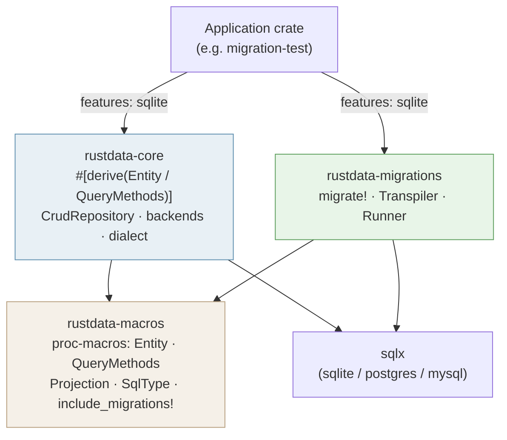

> `rustdata-macros` is a build-host dependency. The arrows into it are compile-time only; it is not linked into the final binary.
>
> **Macro reference:** `Entity` and `QueryMethods` generate the repository traits and implementations. `Projection` generates partial structs for selecting a subset of columns. `SqlType` maps custom Rust types to their SQL representations. `include_migrations!` embeds migration files at compile time.

---

## 3. Compile-time pipeline

The entire data layer — repository types, typed finders, bound SQL fragments, and embedded migration SQL — is generated before a single line of application code is executed.

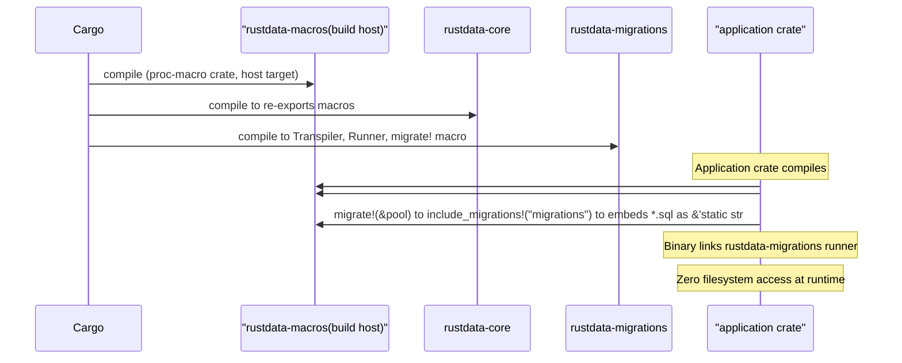

---

## 4. `rustdata-core`

### 4.1 Backend abstraction

The `Backend` trait bundles three associated types that together describe a complete database driver. Every generic bound on `CrudRepository` is expressed in terms of this trait, keeping the repository itself dialect-agnostic.

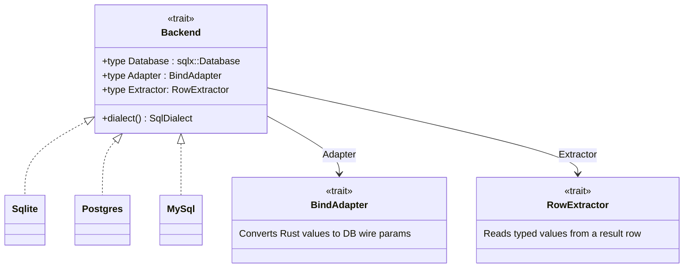

Three concrete backend structs are provided, each gated behind its Cargo feature:

| Struct | `sqlx::Database` | Feature |
|---|---|---|
| `backends::Sqlite` | `sqlx::Sqlite` | `sqlite` |
| `backends::Postgres` | `sqlx::Postgres` | `postgres` |
| `backends::MySql` | `sqlx::MySql` | `mysql` |

**`DefaultBackend`** is a type alias in `rustdata-core` that resolves to the active backend via `cfg(feature)`. The `#[derive(Entity)]` macro references `::rustdata_core::DefaultBackend`, so the generated `UserRepo` alias is always concrete — no generic parameter leaks to the call site.

> **Why not resolve the feature in the macro?** Proc-macro crates compile for the build host and do not inherit the consumer crate's Cargo features. A `cfg(feature = "sqlite")` guard inside `rustdata-macros` is always false. Placing the feature-conditioned alias in `rustdata-core` — where the features are actually declared — ensures correct resolution. See [§8](#8-design-decisions) for the full rationale.

---

### 4.2 `EntityDescriptor` trait

The central trait implemented by `#[derive(Entity)]`. Every repository method is written purely against this trait; no concrete struct types appear in `rustdata-core`.

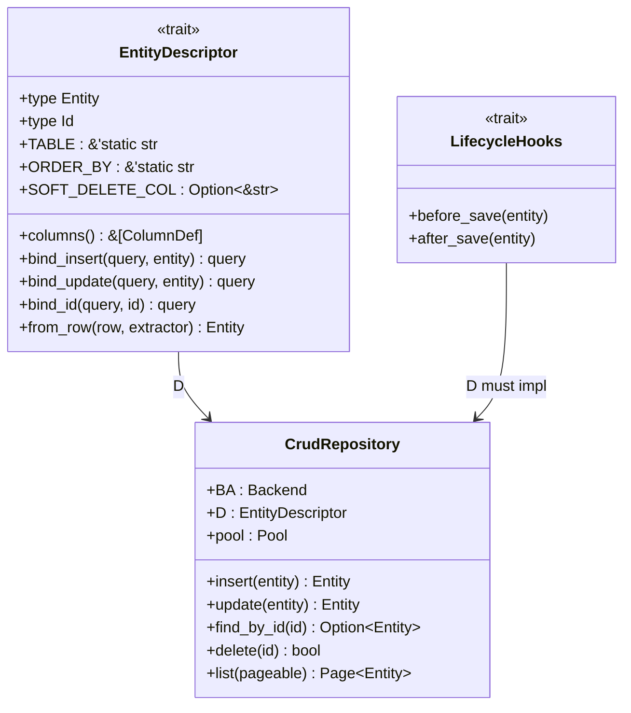

All SQL strings are generated on first call from `D`'s constants and `BA`'s dialect, then cached in a `std::sync::OnceLock<String>`.

---

### 4.3 `CrudRepository` method surface

```
┌─────────────────────────────────────────────────────────────────┐
│ CrudRepository<BA: Backend, D: EntityDescriptor>                │
├──────────────────────┬──────────────────────────────────────────┤
│ Core CRUD            │ insert · update · find_by_id             │
│                      │ delete · hard_delete · exists_by_id      │
├──────────────────────┼──────────────────────────────────────────┤
│ Bulk / list          │ find_all · find_all_sorted · list        │
│                      │ insert_batch · clear · count             │
├──────────────────────┼──────────────────────────────────────────┤
│ Predicate queries    │ find_all_pred · find_all_pred_paged      │
│                      │ find_one_pred · count_pred · delete_pred │
│                      │ count_with_filters                       │
├──────────────────────┼──────────────────────────────────────────┤
│ Specification        │ find_one_spec · find_all_spec            │
│                      │ count_spec · exists_spec                 │
├──────────────────────┼──────────────────────────────────────────┤
│ Ad-hoc SQL           │ find_one_by_sql · find_many_by_sql       │
│                      │ execute_sql                              │
└──────────────────────┴──────────────────────────────────────────┘
```

> **`count_with_filters`** accepts raw SQL `WHERE` fragments and bound parameters, bridging the gap between the strongly-typed Specification pattern and completely ad-hoc SQL.
>
> **`QueryRepository<BA, D>`** is a read-only subset of `CrudRepository` that only exposes `find_*`, `count_*`, and `exists_*` methods. It is useful for injecting into services that should not mutate state.

---

### 4.4 SQL generation and caching

Static SQL strings are assembled once per (`Backend`, `EntityDescriptor`) pair and stored in `OnceLock<String>` statics. Predicate queries build SQL dynamically at call time with a fresh placeholder counter.

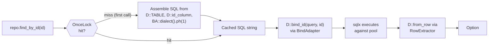

---

### 4.5 `#[derive(Entity)]`

For a struct `User`, the macro emits four items into the user's crate:

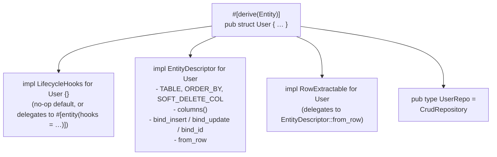

---

### 4.6 `#[derive(QueryMethods)]`

Rust's coherence rules forbid adding methods to a foreign type (`CrudRepository` lives in `rustdata-core`) from an outside crate. The macro works around this by generating **local traits** — traits defined in the user's crate after expansion, which may then be implemented for any foreign type.

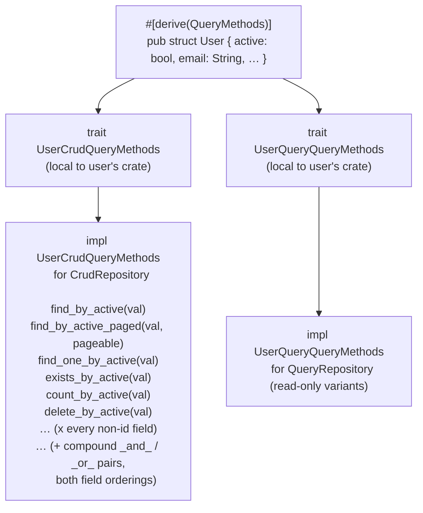

All generated method bodies delegate to inherent methods on `CrudRepository` (`find_all_pred`, `find_one_pred`, etc.), passing a `Predicate` built from the typed argument.

---

### 4.7 Soft delete

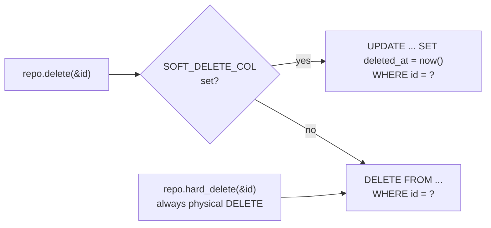

When `#[entity(soft_delete = "deleted_at")]` is present, `EntityDescriptor::SOFT_DELETE_COL` is `Some("deleted_at")` and `CrudRepository::delete` emits an `UPDATE` instead of a `DELETE`. `hard_delete` always emits the physical `DELETE` regardless.

> **`clear()`** always performs a physical `DELETE FROM` (or `TRUNCATE`), bypassing soft-delete logic entirely. It is intended for test teardown or complete table wipes.

---

### 4.8 Lifecycle hooks

`LifecycleHooks<Entity>` provides two hooks called by every `insert` and `update`. `#[derive(Entity)]` emits a blank no-op impl by default. To customise, set `#[entity(hooks = "MyHooks")]` — the macro then delegates to `MyHooks` instead.

```rust
impl LifecycleHooks<User> for MyHooks {
    fn before_save(entity: &mut User) -> Result<(), RepositoryError> {
        entity.updated_at = Utc::now();
        Ok(())
    }

    fn after_save(entity: &User) -> Result<(), RepositoryError> {
        tracing::info!(id = %entity.id, "entity saved");
        Ok(())
    }
}
```

---

### 4.9 Pagination

`Pageable` carries a zero-based `page` index and a `size`. `Page<E>` wraps the result set with metadata:

```
Page<E> {
    content        : Vec<E>   — the rows for this page
    total_elements : u64      — COUNT(*) of the full result set
    total_pages    : u64      — ceil(total_elements / size)
    page           : u64      — current page index (0-based)
    size           : u64      — requested page size
}
```

Pagination always issues two queries: a `SELECT COUNT(*)` for the total, then `SELECT … LIMIT ? OFFSET ?` for the page content.

---

### 4.10 Specification pattern

`Predicate` is a recursive enum. Combine variants to build arbitrarily complex query conditions without writing SQL.

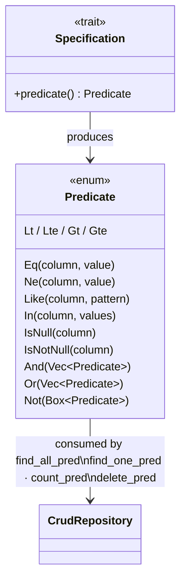

Implement `Specification<User>` on a domain type to encapsulate a business rule as a reusable, composable object.

---

### 4.11 Error handling

`RepositoryError` normalises all database-specific error codes into typed variants so application code is dialect-independent.

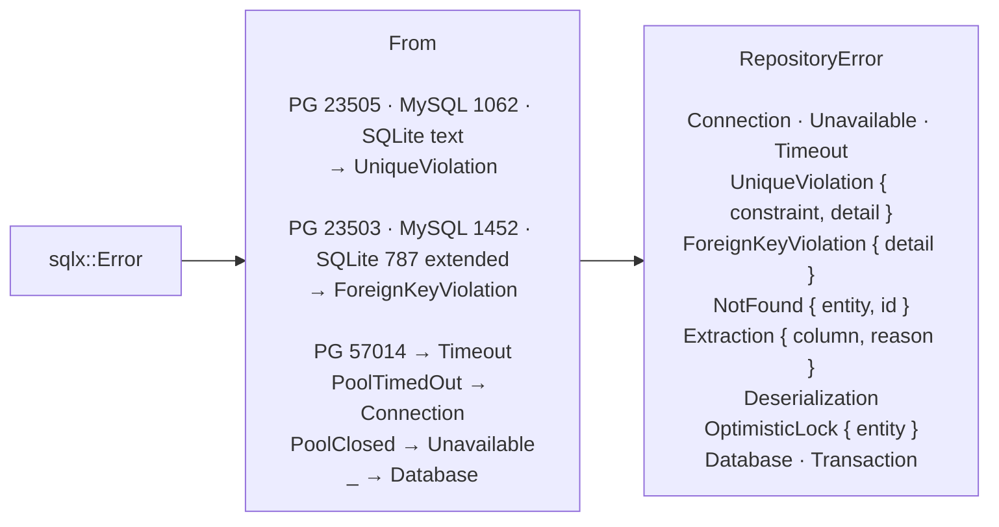

---

### 4.12 Transactions

`CrudRepository` can be constructed from either a `sqlx::Pool` for auto-commit operations, or a `sqlx::Transaction` to participate in an explicit transaction. When using a transaction, all operations (`insert`, `update`, `delete`, etc.) execute within that transaction scope. The transaction commits or rolls back based on the caller's logic, keeping repository methods unaware of transaction boundaries.

```rust
let mut tx = pool.begin().await?;
let repo = UserRepo::new(&mut tx);
repo.insert(user.clone()).await?;
repo.delete(&user.id).await?;
tx.commit().await?;
```

---

## 5. `rustdata-migrations`

### 5.1 Compile-time embedding

`include_migrations!(path)` is a proc-macro that runs entirely at compile time:

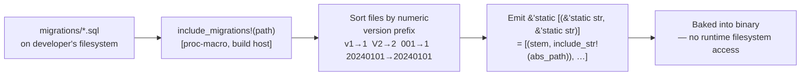

### 5.2 `migrate!` macro

```rust
rustdata_migrations::migrate!(&pool).await?;

// expands to:
const MIGRATIONS: &[(&str, &str)] =
    rustdata_macros::include_migrations!("migrations");
rustdata_migrations::__run_migrations(&pool, MIGRATIONS).await?;
```

`__run_migrations` dispatches via the sealed `__PoolDispatch` trait:

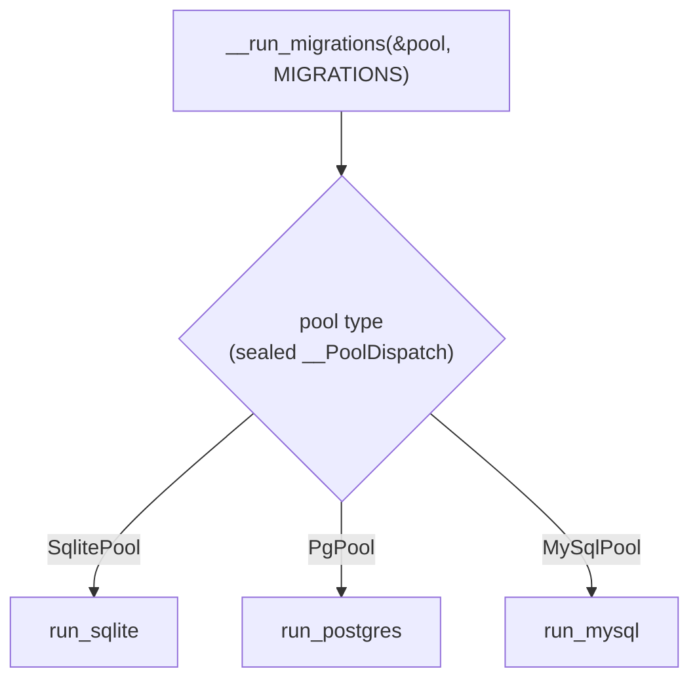

### 5.3 Runner

Each dialect runner applies the embedded migrations in ascending version order:

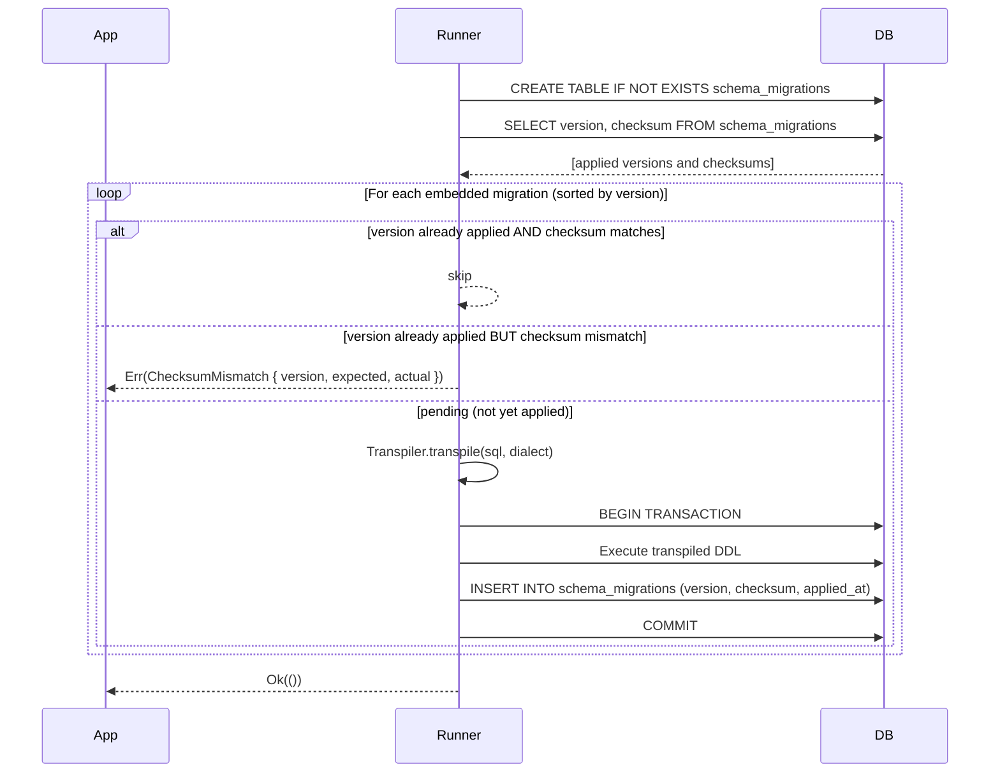

The checksum (SHA-256 of the original canonical SQL) detects accidental edits to already-applied migrations and fails fast rather than silently applying a corrupted history.

### 5.4 Transpiler

The transpiler is a line-oriented, annotation-aware two-pass engine.

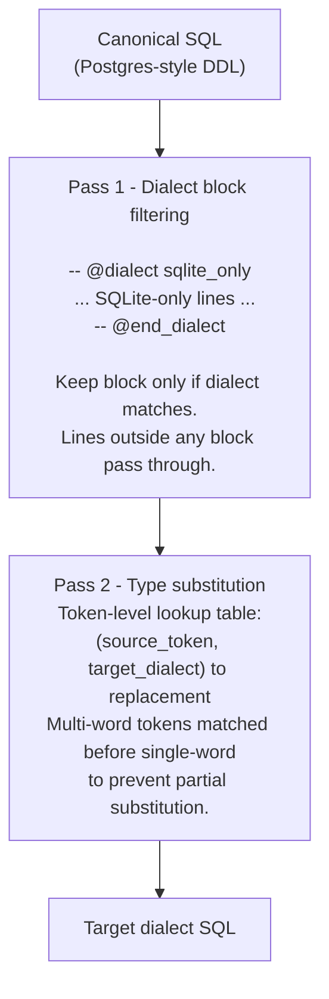

Type mapping reference:

| Canonical (Postgres) | SQLite | MySQL |
|---|---|---|
| `UUID` | `TEXT` | `CHAR(36)` |
| `TIMESTAMPTZ` | `TEXT` | `DATETIME` |
| `BOOLEAN` | `INTEGER` | `TINYINT(1)` |
| `BIGSERIAL` | `INTEGER AUTOINCREMENT` | `BIGINT AUTO_INCREMENT` |
| `DEFAULT gen_random_uuid()` | `DEFAULT (lower(hex(randomblob(16))))` | *(removed)* |
| `DEFAULT now()` | `DEFAULT (datetime('now'))` | `DEFAULT CURRENT_TIMESTAMP` |
| `DOUBLE PRECISION` | `REAL` | `DOUBLE` |

`SqlDialect::ph(n)` selects the placeholder style: `$n` (Postgres), `?` (SQLite/MySQL), `@Pn` (MSSQL).

> **MSSQL support:** The `@Pn` placeholder format is reserved for forward compatibility. Full MSSQL backend support is planned but not yet implemented.

---

## 6. Data flow: a single `insert`

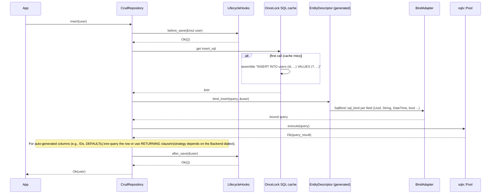

---

## 7. Data flow: migration startup

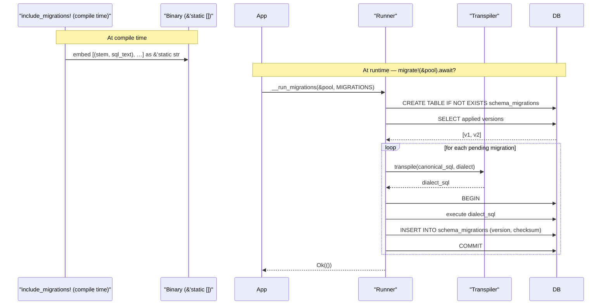

---

## 8. Design decisions

### `EntityDescriptor` instead of direct sqlx traits

sqlx's `FromRow`, `Encode`, and `Decode` traits carry a concrete database type as a type parameter, which leaks the dialect through every generic bound in the call tree. `EntityDescriptor` encapsulates bind and extract logic behind a trait with generic `DB` and `B: BindAdapter<DB>` parameters. `CrudRepository` then stays fully dialect-generic — switching from SQLite to Postgres requires only a feature flag change, with no application code changes.

### Local traits for `QueryMethods`

Rust's orphan rule forbids `impl<BA> CrudRepository<BA, User> { … }` from a crate that doesn't own `CrudRepository`. The macro generates a *local* trait (`UserCrudQueryMethods`) in the expansion crate (the user's crate), then implements it for the foreign type. `impl LocalTrait for ForeignType` is always permitted. Method bodies live in the `impl` block rather than as trait defaults so that `self.find_all_pred(…)` resolves correctly against `CrudRepository`'s concrete inherent methods without additional bounds on the trait definition.

### `DefaultBackend` in `rustdata-core`, not in the macro

Proc-macro crates compile for the build host and do not inherit the consumer crate's Cargo features. Every `cfg(feature = "sqlite")` guard inside `rustdata-macros` evaluates against the macro crate's own feature set — which declares none — so the guard is always false. Placing the feature-conditioned `DefaultBackend` alias in `rustdata-core` (where `sqlite`, `postgres`, and `mysql` are actually declared) ensures the correct backend is selected and the generated `UserRepo` alias is always a concrete, fully-resolved type.

### Compile-time migration embedding

`include_str!` bakes each SQL file into the binary at compile time. This means:

- **Self-contained binary** — no migration directory needed at the deployment target.
- **Compiler catches missing files** — a deleted or renamed SQL file is a compile error, not a silent runtime failure.
- **No runtime I/O** — startup is faster; the binary works in read-only environments (containers, serverless).

The trade-off is that adding a migration requires a recompile. For a database-backed application this is not a meaningful constraint: schema changes always require a deployment anyway.