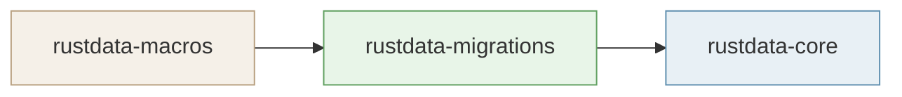

# Publishing to crates.io

This workspace ships three crates in dependency order. `migration-test` is an integration-test crate and must **not** be published.



---

## Table of contents

1. [Prerequisites](#1-prerequisites)
2. [How versions work](#2-how-versions-work)
3. [Option A — Automatic (GitHub Actions)](#3-option-a--automatic-github-actions)
4. [Option B — Manual step-by-step (local)](#4-option-b--manual-step-by-step-local)
5. [Verify on crates.io](#5-verify-on-cratesio)

---

## 1. Prerequisites

- A [crates.io](https://crates.io) account with the token scoped to publish.
- `CARGO_REGISTRY_TOKEN` stored as a GitHub Actions secret:
  GitHub → Repository → **Settings** → **Secrets and variables** → **Actions** → **New repository secret**
- For manual releases: Python 3 and `cargo-edit` installed:

```bash
cargo install cargo-edit --locked   # provides cargo set-version
```

---

## 2. How versions work

All three crates share one version, set in `crates/rustdata-core/Cargo.toml` and propagated to all workspace members automatically.

### How `Cargo.toml` files are updated

```
cargo set-version --workspace X.Y.Z
```

This rewrites the `version =` field in every workspace member's `Cargo.toml`:

```
crates/rustdata-core/Cargo.toml       →  version = "0.2.0"
crates/rustdata-migrations/Cargo.toml  →  version = "0.2.0"
crates/rustdata-macros/Cargo.toml      →  version = "0.2.0"
```

### Automatic version bump

Version bumps are automatic — choose `patch` / `minor` / `major` and the next version is calculated:

| Bump | Transition |
|---|---|
| **patch** | `0.1.0` → `0.1.1`
| **minor** | `0.1.0` → `0.2.0`
| **major** | `0.1.0` → `1.0.0`

### Version override (pin an exact version)

Both `workflow_dispatch` inputs have an optional `version` field that, when filled, skips the automatic bump and forces that exact version.

**GitHub Actions**: leave the **bump** dropdown and provide a `version` in the `version` input (e.g. `0.1.1`).

**Manual**: `make bump-version VER=1.0.0` pins any exact version.

The override takes precedence over the `bump` type. Use it when a published version has been yanked, a build needs to be re-issued, or you need to correct the version number.

### How git tags are created

After version bump, an annotated (not signed) tag is created and pushed:

```bash
TAG="v0.2.0"
git commit -am "release: v0.2.0"
git tag -a "$TAG" -m "Release $TAG"
git push origin --follow-tags
```

- Tag name: `v<version>` pointing at the version-bump commit
- Tag message: `Release v0.2.0`
- Pushed with `--follow-tags` so both the annotated tag and its commit are on the remote
- Verified via `git tag -l | grep v0.2.0`
```
cargo set-version --workspace X.Y.Z
```

This rewrites the `version =` field in every workspace member's `Cargo.toml`:

```
crates/rustdata-core/Cargo.toml       →  version = "0.2.0"
crates/rustdata-migrations/Cargo.toml  →  version = "0.2.0"
crates/rustdata-macros/Cargo.toml      →  version = "0.2.0"
```

### How the next version is computed

The bump type (`patch` / `minor` / `major`) is applied to the current version automatically:

- **patch** — last segment +1: `0.1.0` → `0.1.1`
- **minor** — middle segment +1, patch reset: `0.1.0` → `0.2.0`
- **major** — first segment +1, others reset: `0.1.0` → `1.0.0`

Runs in GitHub Actions via `actions/github-script@v7`, locally via `make bump-version VER=0.2.0`.

### How git tags are created

After version bump, an annotated tag is created and pushed:

```bash
TAG="v0.2.0"
git commit -am "release: v0.2.0"              # commit the version + changelog changes
git tag -a "$TAG" -m "Release $TAG"           # local annotated tag
git push origin --follow-tags                  # pushes commit + tag to remote
```

- Tag name: `v<version>` pointing to the version-bump commit
- Tag message: `Release v0.2.0`
- Pushed with `--follow-tags` so the annotated tag and its commit are both on the remote
- Verified via `git tag -l | grep v0.2.0`

---

## 3. Option A — Automatic (GitHub Actions)

**Trigger:** GitHub → **Actions** → `rustdata-release` → **Run workflow**
Choose `patch`, `minor`, or `major`, or leave it blank and fill `version` to pin an exact release.

### What it does — step by step

```
1 ─ validate job (runs on every push / PR too)
   │
   ├── cargo fmt --all -- --check
   ├── cargo clippy --all-targets --all-features -- -D warnings
   ├── cargo test --workspace --all-features
   └── cargo publish --dry-run -p rustdata-macros   ← leaf crate only

2 ─ release job (manual dispatch only, after validate passes)
   │
   ├── compute next version  (github-script)
   │     if version input is set → use it directly
   │     else → apply bump type to current version
   ├── cargo set-version --workspace X.Y.Z          ← updates Cargo.toml in all 3 crates
   ├── update CHANGELOG.md
   ├── git commit -am "release: vX.Y.Z"
   ├── git tag -a "vX.Y.Z" -m "Release vX.Y.Z"
   ├── git push origin --follow-tags                ← pushes commit + version tag
   ├── cargo publish -p rustdata-macros   --allow-dirty   ← real publish ①
   ├── cargo publish -p rustdata-migrations --allow-dirty ← real publish ②
   ├── cargo publish -p rustdata-core     --allow-dirty   ← real publish ③
   └── create GitHub Release
```

**Key points:**


- `cargo publish` uses `--allow-dirty` because the working tree has uncommitted changes from `set-version` + `changelog`, both of which are captured in the commit pushed at step 2.
- `publish --dry-run` in `validate` runs only on `rustdata-macros` (the leaf crate — it has no workspace dependencies, so it can be fully validated locally). `rustdata-migrations` and `rustdata-core` are validated by `cargo test` which already runs in the same job.

---

## 4. Option B — Manual step-by-step (local)

Run these commands locally for full control or to debug individual steps.

```bash
# 1. Quality gate — fmt + clippy + test
make check

# 2. Preview what would be uploaded (no network write)
make publish-dry-run

# 3. Bump all three crates (automatic semver, or pin exact version)
make bump-version VER=0.2.0          # automatic: 0.1.0 → 0.2.0  (equivalent to bump=minor)
make bump-version VER=0.1.1          # exact override: forces 0.1.1 regardless of bump type

# 4. Insert / update the [x.y.z] section in CHANGELOG.md
make changelog

# 5. Commit + annotated tag + push to origin
make tag

# 6. Upload all three crates to crates.io in dependency order
make publish-upload
```

Or run the full pipeline in one shot:

```bash
make publish
```

### Command reference

| Command | Description |
|---|---|
| `make check` | `cargo fmt --check`, `cargo clippy -D warnings`, `cargo test --workspace --all-features` |
| `make publish-dry-run` | `cargo publish --dry-run` on `rustdata-macros` only — no files changed, no network write |
| `make bump-version VER=x.y.z` | `cargo set-version --workspace x.y.z` — rewrites `version =` in all 3 `Cargo.toml` files |
| `make changelog` | Injects `## [x.y.z] - YYYY-MM-DD` section into `CHANGELOG.md` |
| `make tag` | `git commit -am`, `git tag -a "vX.Y.Z"`, `git push origin --follow-tags` — annotated tag pointing at the version-bump commit |
| `make publish-upload` | `cargo publish` × 3 in dependency order with `--allow-dirty` — this is the step that actually publishes to crates.io |
| `make publish` | Runs `check` → `changelog` → `publish-dry-run` → `tag` → `publish-upload` in sequence |

---

## 5. Verify on crates.io

After publishing, confirm all three crates are live:

```bash
cargo search rustdata-macros
cargo search rustdata-migrations
cargo search rustdata-core
```

Or visit directly:

- https://crates.io/crates/rustdata-macros
- https://crates.io/crates/rustdata-migrations
- https://crates.io/crates/rustdata-core

---

## Post-release checklist

- [ ] All three crates appear on crates.io with the correct version.
- [ ] `CHANGELOG.md` on `master` has the new `[x.y.z]` section.
- [ ] `origin` has the annotated tag (`git tag -l | grep vX.Y.Z`).
- [ ] GitHub Release is live with the correct tag and release notes.
