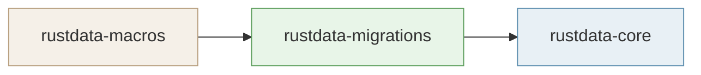

# Publishing to crates.io

This workspace ships three crates in dependency order. `migration-test` is an integration-test crate and must **not** be published.



---

## Table of contents

1. [Prerequisites](#1-prerequisites)
2. [Option A — Automatic (GitHub Actions)](#2-option-a--automatic-github-actions)
3. [Option B — Manual step-by-step (local)](#3-option-b--manual-step-by-step-local)
4. [Verify on crates.io](#4-verify-on-cratesio)

---

## 1. Prerequisites

- A [crates.io](https://crates.io) account with the token scoped to publish.
- `CARGO_REGISTRY_TOKEN` stored as a GitHub Actions secret:
  GitHub → Repository → **Settings** → **Secrets and variables** → **Actions** → **New repository secret**
- For manual releases: Python 3 and `cargo-edit` installed:

```bash
cargo install cargo-edit --locked   # provides cargo set-version
```

---

## 2. Option A — Automatic (GitHub Actions)

**Trigger:** GitHub → **Actions** → `rustdata-release` → **Run workflow**
Choose `patch`, `minor`, or `major`, then click **Run**.

### What it does

```
fmt → clippy → test → publish --dry-run (macros)
  → compute next version → set-version → update CHANGELOG.md
  → commit + annotated tag → git push origin → cargo publish (macros → migrations → core)
  → create GitHub Release
```

`publish --dry-run` only runs on `rustdata-macros` (leaf crate — no workspace deps).
`rustdata-migrations` and `rustdata-core` are validated by `cargo test` in the same job.

The `GITHUB_TOKEN` is provided automatically. Only `CARGO_REGISTRY_TOKEN` is needed.

---

## 3. Option B — Manual step-by-step (local)

Run these commands locally for full control, or to debug individual steps.

```bash
# 1. Quality gate — fmt + clippy + test
make check

# 2. Preview what would be uploaded (no network write)
make publish-dry-run

# 3. Bump all three crates to a specific version
make bump-version VER=0.2.0

# 4. Insert / update the [0.2.0] section in CHANGELOG.md
make changelog

# 5. Commit + annotated tag + push to origin
make tag

# 6. Upload all three crates to crates.io (macros → migrations → core)
make publish-upload
```

Or run the full pipeline in one shot:

```bash
make publish
```

### Command reference

| Command | Description |
|---|---|
| `make check` | `cargo fmt --check`, `cargo clippy -D warnings`, `cargo test --workspace --all-features` |
| `make publish-dry-run` | `cargo publish --dry-run` on `rustdata-macros` only (leaf crate) |
| `make bump-version VER=x.y.z` | `cargo set-version --workspace` across all three crates |
| `make changelog` | Injects `## [x.y.z] - YYYY-MM-DD` section into `CHANGELOG.md` |
| `make tag` | `git commit -am`, `git tag -a`, `git push origin --follow-tags` |
| `make publish-upload` | `cargo publish` × 3 in dependency order, `--allow-dirty` |
| `make publish` | All of the above in sequence |

---

## 4. Verify on crates.io

After publishing, confirm all three crates are live:

```bash
cargo search rustdata-macros
cargo search rustdata-migrations
cargo search rustdata-core
```

Or visit directly:

- https://crates.io/crates/rustdata-macros
- https://crates.io/crates/rustdata-migrations
- https://crates.io/crates/rustdata-core

---

## Post-release checklist

- [ ] All three crates appear on crates.io with the correct version.
- [ ] `CHANGELOG.md` on `master` has the new `[x.y.z]` section.
- [ ] `origin` has the annotated tag (`git tag -l | grep vX.Y.Z`).
- [ ] GitHub Release is live with the correct tag and release notes (automatic release only).
