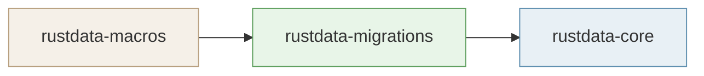
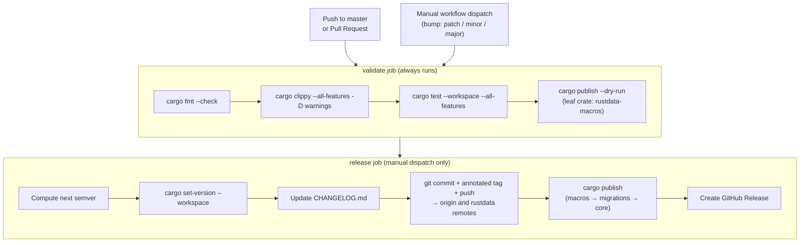
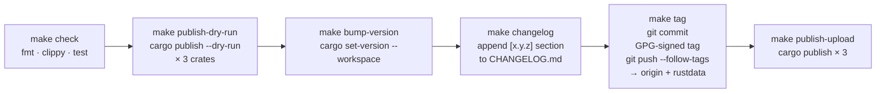

# Publishing to crates.io

This workspace ships three crates in dependency order. `migration-test` is an integration-test crate and must **not** be published.



---

## Table of contents

1. [Prerequisites](#1-prerequisites)
2. [CI overview](#2-ci-overview)
3. [Option A — GitHub Actions](#3-option-a--github-actions)
4. [Option B — Gitea Actions](#4-option-b--gitea-actions)
5. [Option C — `scripts/release.sh`](#5-option-c--scriptsreleasesh)
6. [Option D — `make` targets](#6-option-d--make-targets)
7. [Verify on crates.io](#7-verify-on-cratesio)
8. [Post-release checklist](#8-post-release-checklist)

---

## 1. Prerequisites

- A [crates.io](https://crates.io) account with the token scoped to publish.
- `CARGO_REGISTRY_TOKEN` stored as an Actions secret:
  - **GitHub**: Settings → Secrets and variables → Actions → New repository secret
  - **Gitea**: Settings → Actions → Secrets → Add Secret
- For Gitea Actions only: `GH_MIRROR_TOKEN` stored as a Gitea Actions secret — a GitHub PAT with `repo` scope, used to push the release tag to the GitHub mirror via HTTPS (SSH access from Gitea runners to GitHub is not assumed).
- For local releases: `git` with GPG or SSH tag signing configured, and `cargo-set-version` installed:

```bash
cargo install cargo-edit --locked   # provides cargo set-version
```

---

## 2. CI overview

Two nearly identical pipelines exist — one for GitHub Actions, one for Gitea Actions. Both define the same two jobs.



The `release` job only runs on **manual dispatch** and only after `validate` passes.

---

## 3. Option A — GitHub Actions

**Trigger:** GitHub → Actions → `rustdata-release` → **Run workflow**

| Input | Values |
|---|---|
| **bump** | `patch` (default) · `minor` · `major` |

### What the release job does

| Step | Detail |
|---|---|
| Compute next version | `actions/github-script@v7` reads the current version from `rustdata-core/Cargo.toml` and applies the selected bump type |
| Bump workspace version | `cargo set-version --workspace $VER` updates all three member crates |
| Update `CHANGELOG.md` | Injects a new `## [x.y.z] - YYYY-MM-DD` section below the `# CHANGELOG` header |
| Commit + tag + push | Commits all changes, creates an **annotated** (not signed) tag `vX.Y.Z`, pushes with `--follow-tags` to `origin` (GitHub) — the `rustdata` remote (Gitea over SSH) is not pushed from GitHub runners |
| `cargo publish` | Publishes all three crates in dependency order with `--allow-dirty` |
| Create GitHub Release | `softprops/action-gh-release@v1` creates a GitHub Release from the tag, with the new changelog section as the release body |

> The `GITHUB_TOKEN` secret (write: contents) is automatically available to Actions. Only `CARGO_REGISTRY_TOKEN` must be added manually.

---

## 4. Option B — Gitea Actions

**Trigger:** Gitea → Actions → `rustdata-release` → **Run**

The Gitea pipeline is identical to the GitHub pipeline except:

- Version bumping uses `scripts/bump_version.sh` (Python) instead of `actions/github-script`.
- The bump type is controlled by the `BUMP_TYPE` environment variable (default: `patch`) rather than a dropdown input.
- The GitHub Release creation step is absent. To add release notes, call the Gitea Releases API.
- The tag push step adds the GitHub mirror remote via HTTPS + PAT (`GH_MIRROR_TOKEN`) and pushes there too.

---

## 5. Option C — `scripts/release.sh`

The local full-automation script. Calls the Makefile targets in the correct order.

```bash
# Preview only — quality checks + dry-run publish, no files modified
./scripts/release.sh --dry-run

# Interactive — prompts for patch / minor / major before proceeding
./scripts/release.sh

# Non-interactive patch bump, no confirmation prompt
./scripts/release.sh --bump patch --yes

# Non-interactive minor bump, no confirmation prompt
./scripts/release.sh --bump minor --yes
```

### Steps performed



> `--dry-run` stops after step B and makes no changes to files or git history.

**Requirements:** `python3`, `git` with GPG/SSH tag signing, `cargo-set-version`.

---

## 6. Option D — `make` targets

Individual Makefile targets for when you want manual control over each step.

### Step-by-step

```bash
# 1. Quality gate — fmt + clippy + test
make check

# 2. Preview what would be uploaded (no network write)
make publish-dry-run

# 3. Bump all three crates to a specific version
make bump-version VER=0.2.0

# 4. Insert a [0.2.0] section into CHANGELOG.md
make changelog

# 5. Commit + GPG-signed tag + push to origin and rustdata remotes
make tag

# 6. Upload to crates.io (macros → migrations → core)
make publish-upload
```

### `make publish` — full pipeline in one command

Runs all six steps above in sequence:

```bash
make publish
```

Equivalent to: `check → changelog → publish-dry-run → tag → publish-upload`

### Target reference

| Target | Command(s) | Notes |
|---|---|---|
| `make check` | `cargo fmt --check` · `cargo clippy -D warnings` · `cargo test --workspace --all-features` | Fails fast on first error |
| `make publish-dry-run` | `cargo publish --dry-run` × 3 | Requires `CARGO_REGISTRY_TOKEN` to resolve registry metadata |
| `make bump-version VER=x.y.z` | `cargo set-version --workspace x.y.z` | Requires `cargo-edit` |
| `make changelog` | Inserts `## [x.y.z] - YYYY-MM-DD` stub | Reads version from `rustdata-core/Cargo.toml`; skips if entry already present |
| `make tag` | `git commit -am` · `git tag -s` · `git push --follow-tags` | GPG-signs the tag; pushes to both `origin` and `rustdata` remotes |
| `make publish-upload` | `cargo publish` × 3 | Publishes in dependency order; no `--allow-dirty` |
| `make publish` | All of the above | Full pipeline |

---

## 7. Verify on crates.io

After publishing, confirm all three crates are live:

```bash
cargo search rustdata-macros
cargo search rustdata-migrations
cargo search rustdata-core
```

Or visit the pages directly:

- https://crates.io/crates/rustdata-macros
- https://crates.io/crates/rustdata-migrations
- https://crates.io/crates/rustdata-core

---

## 8. Post-release checklist

- [ ] All three crates appear on crates.io with the correct version.
- [ ] The GitHub Release (created by CI) is live with the correct tag and release notes.
- [ ] `CHANGELOG.md` on `master` has the new `[x.y.z]` section.
- [ ] Both `origin` and `rustdata` remotes have the signed tag (`git tag -l | grep vX.Y.Z`).
- [ ] Announce in project channels / discussions.